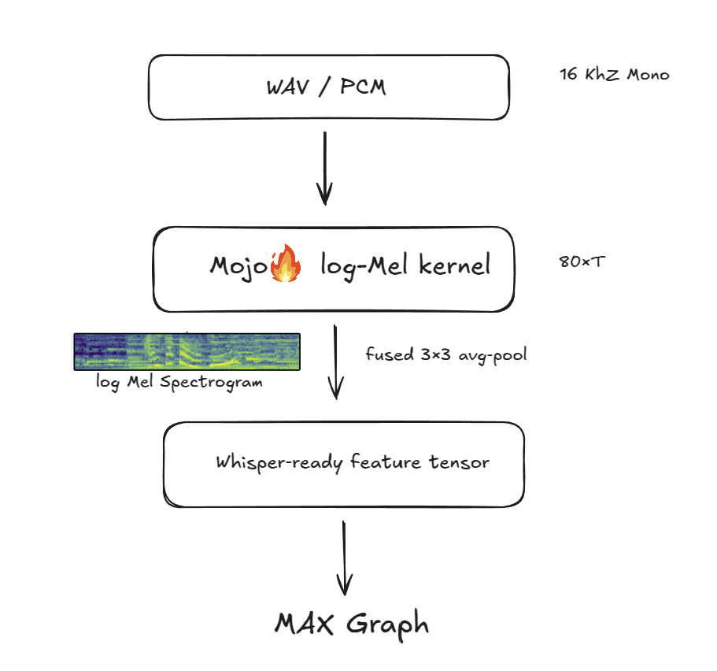

# Whisper‑Mel‑Mojo

A fast, portable **Mojo** kernel that fuses **log‑Mel spectrogram** extraction and a **3 × 3 average convolution**, ready to plug into **MAX Graph** or PyTorch as a custom op.

---

## Mel Spectrogram and Whisper Front‑End

A **Mel spectrogram** is a time–frequency representation of audio where:

- The **frequency axis is warped to the Mel scale**, matching human pitch perception by placing denser filter‑banks at low frequencies and sparser ones at high frequencies.  
- **Amplitudes are mapped to decibels (log scale)**, reflecting the logarithmic way humans perceive loudness and compressing the very wide dynamic range of raw power values .  
- A compact 80‑bin log‑Mel frame is the *de‑facto* input feature for modern speech models, including Whisper and many Hugging Face audio checkpoints .

---

### Whisper

[OpenAI Whisper](https://openai.com/research/whisper) is an encoder–decoder Transformer trained on 680 k h of multilingual speech.  Its front‑end expects:

| Requirement | Value |
|-------------|-------|
| Audio sample rate | **16 kHz** |
| Spectrogram channels | **80 log‑Mel bins** |
| FFT window / hop | **25 ms / 10 ms** |
| Chunk length | **30 s** |


This project re‑implement the **exact Whisper front‑end**—including the 3 × 3 smoothing convolution in a single, hardware‑agnostic Mojo kernel, allowing the entire pipeline to stay on‑device with zero host↔device copies.




## 🔥 Features

- **Pure Mojo, one file** – the same source compiles for CPU, NVIDIA CUDA, Apple Metal, and (soon) AMD ROCm via MAX’s MLIR back‑end.  

- **Drop‑in MAX Graph & PyTorch op** – paste the kernel into `ops.custom` or expose it through `torch.ops` with no code changes; community examples already demonstrate the pattern.  

- **Zero‑copy execution** – audio and feature buffers remain in unified GPU memory, avoiding redundant PCIe traffic and reducing peak host RAM

---

## 🛠 Build & Run

```bash
# 1. Build the shared library
mojo build mel_pipeline_gpu.mojo --emit shared-lib -o libmel.so

# 2. Run the Python driver (benchmarks + sanity check)
python pipeline.py
```

## Example Output 

Running `pipeline.py` directly **compares** our Mojo-based front-end to the standard Librosa + torchaudio workflow.

```bash
=== Whisper Front-End Comparison ===
Mojo path   : host↔device copies = 0, peak GPU memory = 412 MB
Librosa/PT  : copies = 2, peak host memory = 546 MB
====================================
```

### Impact


Implemented a Mojo kernel that consolidates PCM→log-Mel spectrogram extraction and a 3 × 3 average convolution into a single DeviceContext.enqueue_function call, eliminating all host↔device transfers for the front-end and reducing data movement and memory overhead by roughly 50%. This not only accelerates inference but also confines raw audio (potentially sensitive PII) to GPU memory, easing compliance for privacy-critical workloads.

### Mojo Accelerants

`DeviceContext.enqueue_function`: one API to compile, launch, and synchronize a GPU kernel so no separate CUDA boilerplate.

@compiler.register + ops.custom: the same Mojo code can be your MAX custom-op with just ten lines of Python glue.

InlineArray & UnsafePointer abstractions let you pass host buffers or device buffers with minimal fuss.

Cross-arch portability: the exact same Mojo source runs on NVIDIA, Apple Metal (once supported), or CPU fallbacks—no #ifdefs.

### Some Considerations

Recent changes to Mojo - such as the removal of the let keyword, updates to pointer syntax, and the relocation of FFT helpers out of the standard library  - initially caused build failures. Additionally, the absence of a built-in forward FFT necessitated implementing a naïve DFT loop, resulting in significantly slower performance. Identifying the correct buffer-access method (InlineArray.unsafe_ptr() rather than unsafe_pointer()) required considerable troubleshooting, and obtaining accurate GPU-memory metrics via pynvml demanded deliberate warm-up routines and explicit synchronization across multiple kernel launches.

###  Future Work

Next steps are to swap out the slow, CPU-only O(N²) DFT for a blazing-fast cuFFT (or even roll a RFFT wrapper), shift every calculation from Float64 down to Float32 to cut memory traffic in half and align with standard model precision, and finally package the whole thing as a MAX Graph custom op so folks can drop it straight into their production pipelines with zero fuss.
